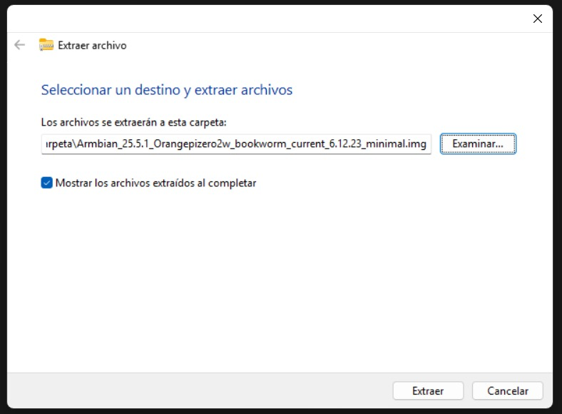
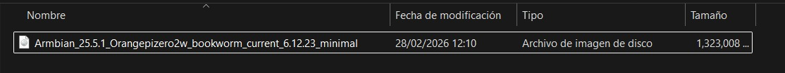
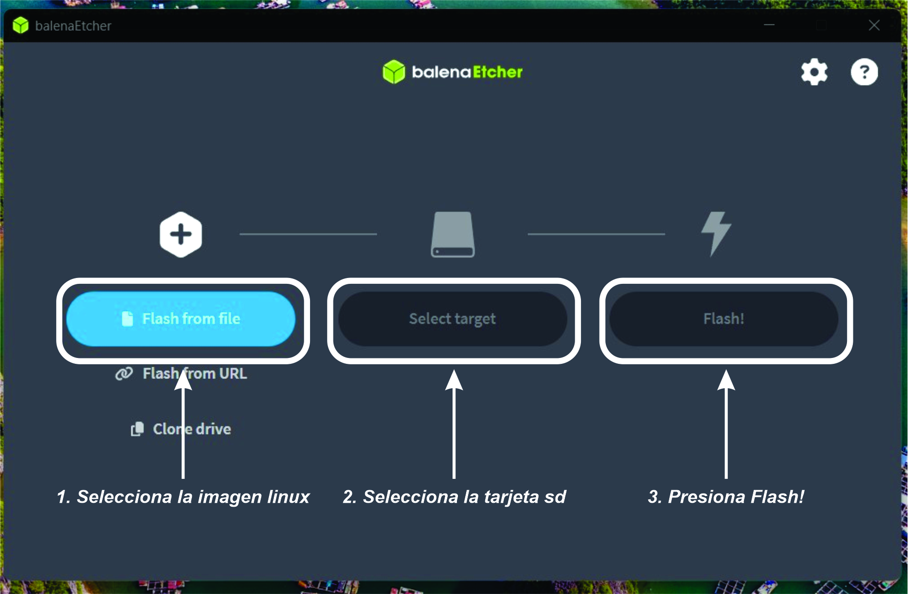

# Instalación del Sistema Operativo Armbian
## 1. Enlaces
- Armbian Debian 12 (Bookworm) minimal: https://www.armbian.com/orange-pi-zero-2w/.
- Balena Etcher: https://etcher.balena.io/
- Manual del fabricante Orange Pi: https://drive.google.com/drive/folders/1KIZMMDBlqf1rKmOEhGH7_7A-COAgYoGZ

## 2. Requisitos
- Una tarjeta SD con las siguientes características:
  1. De clase 10 o mayor.
  2. Capacidad superior a 8 GB.
  3. Preferentemente SanDisk.
     > Si se usa otra SD que no cumpla con estas características, el sistema puede presentar fallos.
- Sistema operativo Debian 12 (Bookworm) versión minimal.

  La Orange Pi Zero 2W es un dispositivo compacto con memoria RAM limitada. Se instala la versión minimal para tener un sistema limpio, libre de servicios que no necesitamos.
- Balena Etcher instalado

  Se utiliza para grabar (flashear) la imagen del sistema operativo en la tarjeta SD.

## 3. Flasheo de la imagen en la tarjeta SD.
1. Descomprime el archivo 'Armbian_25.5.1_Orangepizero2w_bookworm_current_6.12.23_minimal.img.xz', automáticamente se crea una carpeta. Dentro se encuentra un archivo con extensión **.img**, el cual será grabado en la tarjeta SD usando Balena Etcher.

  

  

2. Ejecuta **Balena Etcher** con privilegios de administrador.
   > Si no se ejecuta con privilegios de administrador, el proceso de flasheo fallará.

3. Selecciona:
   1. La imagen `.img` extraída.
   2. La tarjeta SD.
   3. Presiona **Flash!**.

  

4. Cuando el proceso de flasheo termine, desconectar la tarjeta SD de la computadora y conectarla la Orange Pi Zero 2W.
   > Nota: Energizar la placa suando el cable usb conectado a la computadora. Esto nos permitirá usar la conexión USB (interfaz **usb0**) para tener conexión a internet.

  

